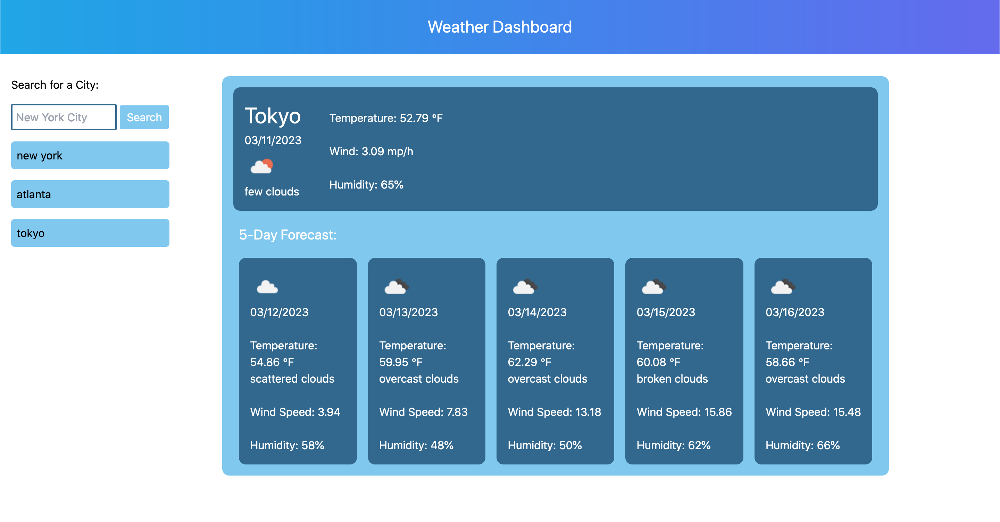

# Weather Checker
This is an application for users to search up weather in a specific city based on search by utiziling OpenWeather API.

Users are able to search any city by name and get the current weather as well as a five-day forecast in the same location.
This app utilizes localStorage to store user's past history in their browser, users are able to see their past history and view the weather in that location by clicking.

## Future Updates
- Add an auto-fill/correct feature for cities so users can more easily input cities and not have to type names exactly as they are spelled.
- Handle non-existent city errors more seamlessly
- add either scrolling to history list or limit number of cities inhistory
- Responsive mobile design
